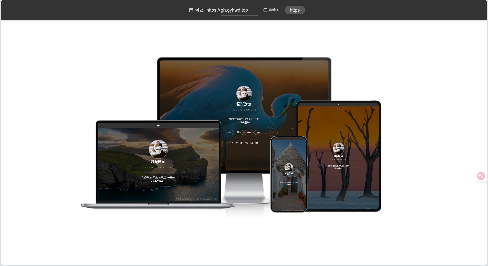

# 多端带壳网站预览工具

[示例网站](https://pv.gyhwd.top) | [个人主页](https://gh.gyhwd.top)

🌐 输入网址，一键生成手机、平板、笔记本、电脑多端带壳预览图

## 项目简介
本项目基于 [himkiong 的 multiterminal-preview](https://github.com/himkiong/multiterminal-preview) 进行开发，旨在生成手机、平板、笔记本、电脑等多种设备的带壳预览图。通过 `iframe` 实现对目标网站的实时加载与预览，并叠加设备外壳，真实还原多端浏览效果。用户可自由切换设备类型，并支持自定义输入任意网址，便于响应式设计的快速验证与分享。

项目采用 **Vue 3 + Vite** 构建，是一个纯静态前端应用，无需后端服务，开箱即用。通过 **GitHub Actions 自动化工作流**，每次代码提交至主分支后，系统会自动构建项目，将生成的 `dist` 目录内容发布至 `page` 分支，并由 GitHub Pages 自动部署上线，真正实现“**git push 即发布**”的高效开发体验。

## 功能特点

- 📱 **多设备支持**：涵盖手机、平板、笔记本、电脑四种主流设备形态。
- 🔁 **实时预览**：通过 `iframe` 动态加载目标网站，所见即所得。
- 🎚️ **细节可控**：可切换是否显示滚动条，模拟真实浏览体验。
- 🌐 **自由跳转**：支持自定义输入任意网址，灵活适配本地或线上站点。
- 🤖 **自动化部署**：集成 GitHub Actions，代码推送自动构建发布，文档更新（如 README）不触发，高效且安静。
- 🚫 **智能过滤**：仅在源码、配置等关键文件变更时触发 CI/CD，避免无效构建。

## 使用方法

### 本地部署：

1. 克隆项目到本地：
   ```bash
   git clone https://github.com/willow-god/multi-terminal-screenshot.git
   ```
   
2. 安装依赖：
   ```bash
   npm install --save
   ```
   
3.  启动开发服务器（用于调试）：
   ```bash
   npm run dev
   ```
   
   在浏览器中打开 `localhost:5173`，即可访问多端预览工具。

4. 构建生产版本（生成 dist，用于静态部署）

   ```bash
   npm run build
   ```

### 在线部署：

由于 `page` 分支已经是静态文件了，直接用 **GitHub Pages** 就足够了！

如果要在 Vercel 部署 page 分支，需要控制台进行单独设置：

1. 进入项目 → **Settings → Build & Deploy**
2. 修改：
   - **Build Command**: `echo "Static site, no build needed"`
   - **Output Directory**: `.`
   - **Framework Preset**: `None`
3. 保存并重新部署

这样 Vercel 就不会执行构建，而是直接发布静态文件。

## 文件结构

- `src/`: 项目主要代码。
- `public/`: 静态资源存放文件夹（如 favicon）。
- `index.html`: 项目的 HTML 入口文件。

## 效果展示


## 贡献指南

欢迎任何形式的贡献！无论是修复 Bug、优化 UI，还是新增设备外壳，都十分感谢。

你可以：

- 🐛 提交 Issue 报告问题
- 🌱 Fork 项目并提交 Pull Request
- 💬 分享使用场景或改进建议

## 致谢

- [清羽飞扬]项目：[willow-god](https://github.com/willow-god)[multi-terminal-screenshot](https://github.com/willow-god/multi-terminal-screenshot)
- 技术栈：Vue 3 + Vite + GitHub Actions